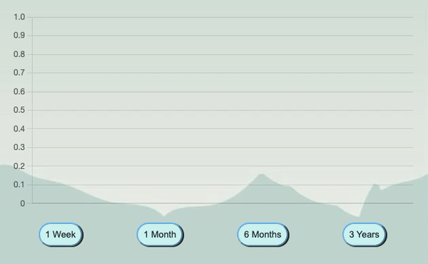
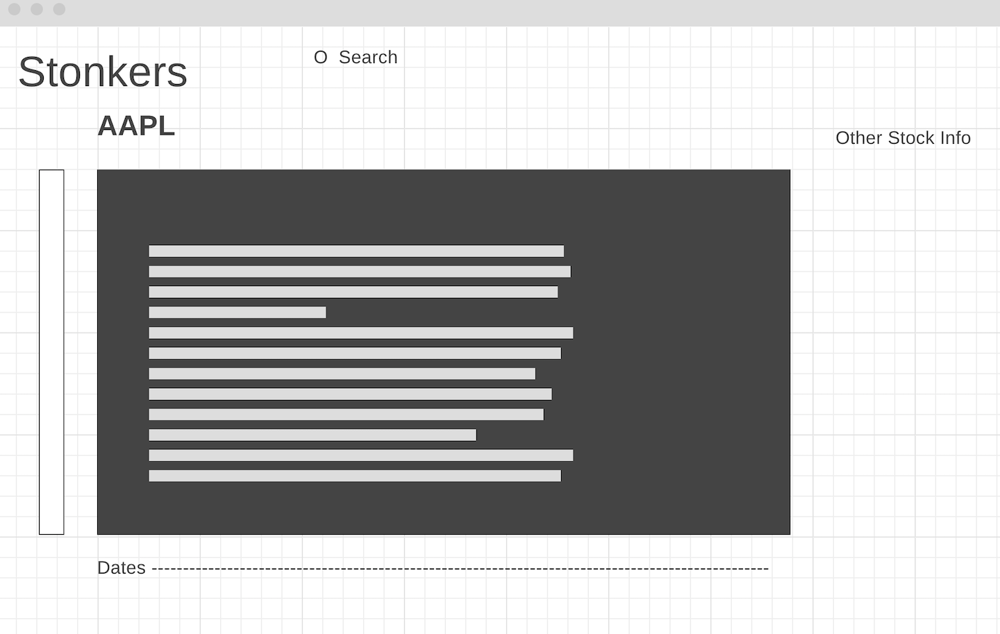

  

# Background

[NasDan](https://dli53.github.io/JSProject-NasDan/) is a data visualization/interactive demonstration that will show the historical data of a stock. User will be able to compare 2 stocks within the same time frame. User will also be able to generate a moving average line to see whether the current price of the stock is above or below a 5 day moving average.

# Features and Instructions

To visualize the data please follow these steps:
1. Type in a Stock Ticker Symbol in the navigation search bar and hit enter.
2. The chart will render the historical prices on the chart and Stock Information on the sidebar.
3. To search and compare 2 stocks, enter in another stock ticker.
4. To view the graph within a certain time frame, click one of these buttons ("1 Week", "1 Month", "6 Months", "3 Years").
5. To generate a moving average line, click "MACD"

# Technologies, Libraries, and API's

- JavaScript : Chart Logic
- Chart.js Canvas : Render Chart
- IEX Cloud API : Stock Info
- Twelve Data API : Historical Stock Data
- Rss.app : Stock Market News - Investing.com
- Markets by TradingView.com : Marqee Rotating Bar
<!-- # Functionality & MVPs -->

<!-- In NasDan, users will be able to:
-   Input a stock ticker
-   Select a time frame
-   Visualize the historical stock price of of the stock as a line graph
-   Compare 2 stocks within the same time frame
-   Generate a 52 wk Average line -->

<!--  -->

# Implementation Timeline
-   Friday: Research, Set up project, and Plan out the design.
-   Weekend : Implement Dynamic API data fetching and Chart.js
-   Monday : Continue with working with API and Chart.JS
-   Tuesday : Style up the website
-   Wednesday : Add Bonus Features
-   Thursday : Finishing touch up and making sure everything runs smoothly
